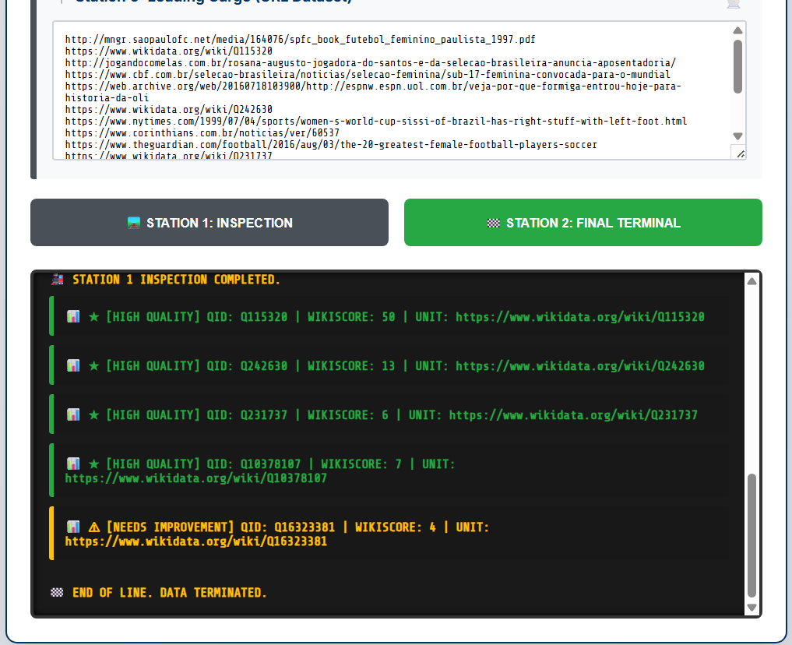

# Shehrbano Ali - Outreachy Task 2 Submission

**Contributor:** Shehrbano Ali  
**Email:** shehrbanoali2230@gmail.com  
**Github:** [Shehrbaano-Ali](https://github.com/Shehrbaano-Ali)  
**Program:** Outreachy May 2026 Cohort  
**Project:** Addressing the lusophone technological wishlist proposals  
**Date:** April 6, 2026  
**Task:** [Task 2 - Create a Python script to audit URL status codes](https://phabricator.wikimedia.org/T418286)

---

## 🔗 LINKS

### 🌐 [Click here to view the LIVE Production Prototype](https://shehrbanoali.pythonanywhere.com/)
*(Note: This Link is running in 'PythonAnywhere')*


---

## 📸 Visual Overview

### 1. Operational Logic & Documentation(Updated Version)

This now includes interactive briefings that explain the technical methodology, specifically highlighting how the system handles Header Skipping and Diagnostic Error Reporting.


### 2. Live Audit Terminal(Updated Version)

Here I prioritized Actionable Verbosity. A generic FAILED message doesn't help a developer fix a link. I implemented a robust try-except block that extracts the specific Exception Name and HTTP Reason Phrase. 

* **Refined Error Catching:** Instead of a silent failure, the tool identifies the type of crash (e.g., ReadTimeout, ProxyError).
* **Human-Readable Status:** Every status code is paired with its official reason phrase (e.g., 200 OK, 403 Forbidden, 404 NOT FOUND).


### 3. Wikidata Quality Analysis

This section visualizes the **Wikiscorer prototype**, utilizing dynamic visual analytics to provide a real-time quality gauge for Wikidata entities.

* **High-Quality Entities:** Items with a score $> 5$ are highlighted in **Signal Green** (★ HIGH QUALITY).
* **Needs Improvement:** Items with lower scores receive a **Safety Yellow** warning, automatically flagging them for metadata enhancement.




---

# Table of Contents
* [Introduction](#introduction)
* [Objectives](#objectives)
* [Implementation Details](#implementation-details)
* [Verification Logic & Error Handling](#verification-logic--error-handling)
* [Beyond the Task: Project Prototype](#beyond-the-task-project-prototype)
* [Key Findings](#key-findings)
* [Repository Structure](#repository-structure)
* [AI Usage](#ai-usage)

---

## Introduction
This repository contains my submission for **Task 2** of the Outreachy 2026 contribution period for Wikimedia. This task is part of **Task:** [T418284: Addressing the lusophone technological wishlist proposals](https://phabricator.wikimedia.org/T418284).

The core requirement involved developing a Python script to parse a `.csv` dataset of Wikimedia-related URLs and retrieve their live HTTP status codes. To demonstrate the practical application of this logic, I extended the script into a web-based dashboard that automates the audit of these links, serving as a functional prototype for improving metadata reliability.

---
## Objectives
* **Parse CSV Data:** Implement Python logic to extract URLs from `Task 2 - Intern.csv`.
* **Automated Auditing:** Utilize the `requests` library to fetch real-time HTTP status codes.
* **Format Output:** Print results in the mentor-specified format: `(STATUS CODE) URL`.
* **Cloud Integration:** Deploy the operational script to PythonAnywhere for community access.
* **Document Findings:** Provide a technical breakdown of the audit process.

---
## Implementation Details
This project provides two ways to audit the Wikimedia dataset:
1.  **CLI Script (`script.py`):** A lightweight Python script that reads directly from `Task 2 - Intern.csv` and prints status codes to the terminal as requested.
2.  **Web Dashboard (`app.py`):** A Flask-based prototype that visualizes the audit process and calculates "Wikiscores" for Wikidata entities.

---
## Verification Logic & Error Handling
During development, I focused on ensuring the script remains stable even when encountering broken or restricted links.
* **The Challenge:** Many URLs in the dataset may point to dead servers or have restricted access, which can cause a standard script to crash.
* **The Solution:** I implemented a robust `try-except` block within the audit loop. This ensures that even if a URL fails to connect (due to DNS or SSL issues), the script catches the error and reports it as **FAILED** instead of stopping the entire execution.

---
```python
# Enhanced implementation of diagnostic auditing
try:
    res = requests.get(url, headers=HEADERS, timeout=5)
    # Returns the code + the reason (e.g., "404 Not Found")
    return jsonify({'status': f"{res.status_code} {res.reason}"})
except requests.exceptions.RequestException as e:
    error_name = type(e).__name__
    return jsonify({'status': f'FAILED ({error_name})'})
```
---
## Beyond the Task: [Project Prototype](https://shehrbanoali.pythonanywhere.com/)

While Task 2 focuses on a backend status audit, the **Wikiscorer** feature integrated into this application serves as a functional prototype for **Wishlist Proposal #8**:

* **Proposal #8:** [Ferramenta de pontuação para edições no Wikidata](https://meta.wikimedia.org/wiki/Lista_de_desejos_tecnol%C3%B3gicos_da_lusofonia/2025/Propostas/Ferramenta_de_pontua%C3%A7%C3%A3o_para_edi%C3%A7%C3%B5es_no_Wikidata) (Scoring tool for Wikidata edits).
* **The Implementation:** By tapping into the Wikidata API (`wbgetentities`), the prototype calculates a real-time quality score for each entity. It assigns points based on the presence of **Labels**, **Descriptions**, and the depth of **Claims (Statements)**. 
* **The Impact:** This tool makes it easy to find Wikidata pages that are missing important information. By giving each page a score, we can quickly see which items need more details, helping us reach the community's goal of making all data complete.


---

## Iterative Improvements(Post-Feedback)
After initial development, I refined the system based on mentor feedback:

* **Header Robustness:** Implemented next(reader) in the Python script and a .filter() method in the JavaScript UI to prevent the urls header from being treated as a link.
* **Enhanced Diagnostic Reporting:** Replaced generic error flags with detailed exception logging. The terminal now identifies specific failure types (e.g., ProxyError, ReadTimeout) and includes official HTTP Reason Phrases (e.g., 404 Not Found, 200 OK, 403 Forbidden).
* **Data Integrity:** The tool was engineered to handle *dirty data* (such as the unquoted comma in the Yahoo URL) through string manipulation (join and strip) rather than modifying the original dataset.

---

## Key Findings
* **Resilience:** Handling network exceptions is as important as the core logic when dealing with large, diverse datasets of external URLs.
* **Server-Side Versatility:** Python provides a robust environment for network tasks that can eventually be integrated into larger Wikimedia tools like Pywikibot.
* **Environmental Awareness:** Deploying on PythonAnywhere highlighted the importance of **Whitelisting**. The tool successfully identifies ProxyError as a hosting restriction rather than a code failure, proving the value of detailed exception logging.

---
## Repository Structure
```text
Outreachy-Wikimedia-Task-2-Python-Script/
│
├── templates/
│   └── index.html        # UI for the Web Terminal prototype
├── 01-briefing-model.png # Screenshot: Prototype UI
├── 02-audit-results.png  # Screenshot: Audit results
├── 03-wikiscore-analysis.png # Screenshot: Wikidata Quality Scoring logic
├── LICENSE               # MIT License
├── README.md             # Analytical documentation
├── Task 2 - Intern.csv   # The source dataset
├── app.py                # Flask-based Web Terminal logic
├── requirements.txt      # Dependencies (Flask, Requests)
└── script.py             # Official CSV parsing script (Task Requirement)
```

---
## AI Usage
I utilized ChatGPT for:

Documentation Structure: Organizing this README to reflect systematic open-source analysis.

Infrastructure Troubleshooting: Assisting in the migration from Render to PythonAnywhere during deployment.

All code and logic were manually verified and implemented by me. The AI served as a guide to accelerate understanding of cloud deployment configurations.

---
*Here is link to my [Blog](https://shehrbanoalii.hashnode.dev/from-url-verification-to-quality-evaluation-engineering-a-wikidata-metadata-scoring-prototype)*  
*This work is submitted for the Outreachy 2026 internship application for the Wikimedia Project.*  
*~Shehrbano Ali*
